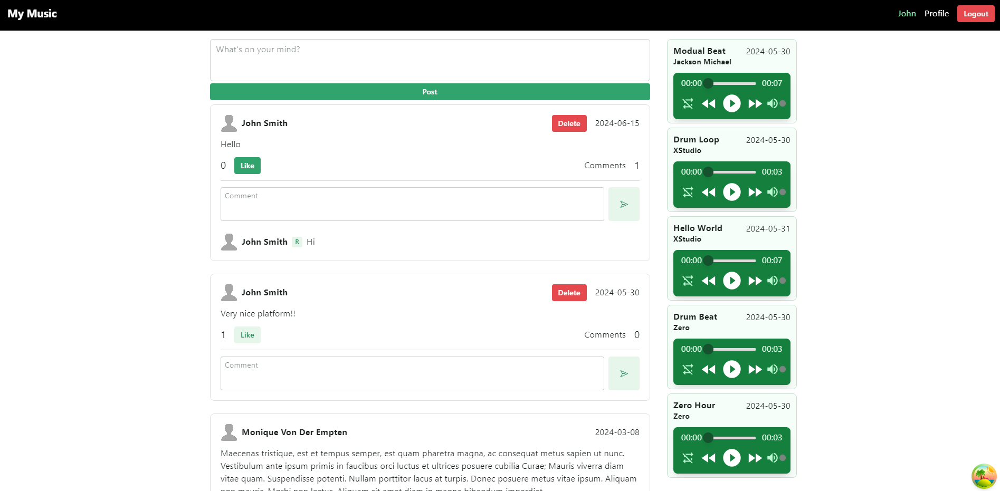
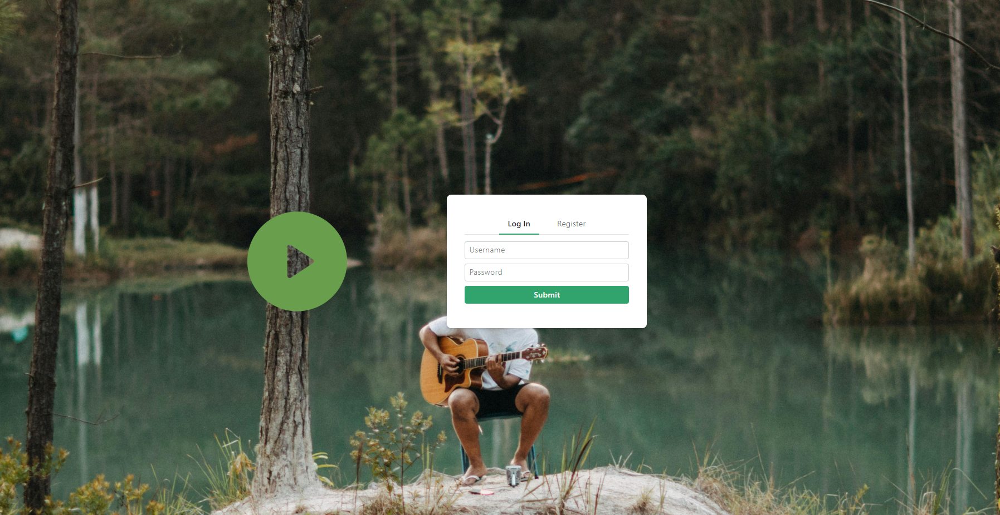
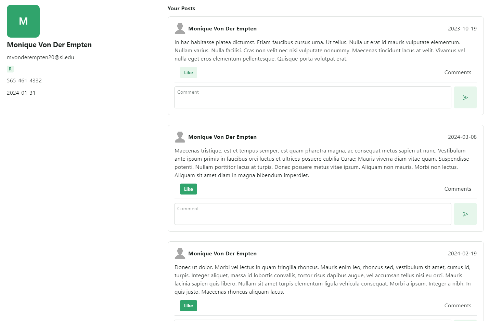

# My Music - Client

This frontend project is a simple social media application with music player that built with React and TypeScript. It allows users to listen to music, register and login easily, create posts, delete posts, add comments, like a post, and visit a profile.

## Features

- Register and login: the user's session is managed with auth tokens using Djoser from the backend, key user details is saved in the session storage with `Zustand` to avoid many requests.

- Optimistic updates: with React Query v5, the updates are reflected directly and invalidated in the background.
- Infinite scrolling
- RadixUI components
- Profile page: for each user that shows users posts, followers and followings.

## Contribution

The project has a high potential to be developed and improved by adding extra features. It is good to note that there are many endpoints from the backend (such as: edit a post/comment, follow/unfollow user, change profile image...) that have not been used due to time constraints.

They may be added by me in the future, till then, contributions are welcome.
