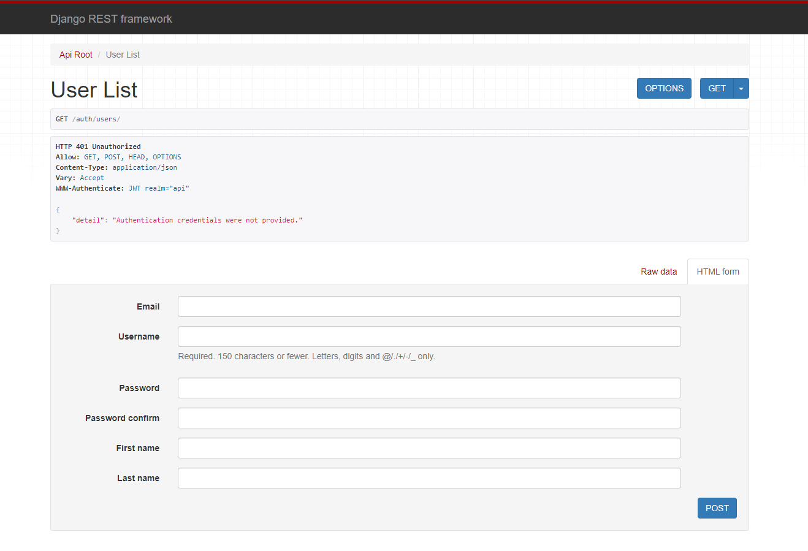

# My Music - Server

This is the server for the My Music app, built with Django 5.0 and many libraries. It is meant to be independent, scalable and easy to maintain.

The project allows:

1. Social:
   1. Post: create, delete, edit, get and retrieve.
   2. Like: add and delete.
   3. Comment: create, delete, edit, get and retrieve.
   4. Follower: create and delete.
   5. Customer (user): create a profile, get and update.
2. Music:
   1. Genre: get and retrieve
   2. Artist: get and retrieve
   3. Song: create, delete, edit, get and retrieve
   4. Playlist: create, delete, edit, get and retrieve

Different routes actions depend on the auth status!

## Features:

- The project uses different reusable apps meant to be independent, in which they do not intersect or intervene
- Django REST Framework
- Djoser for JWT authentication with access and refresh tokens

- ViewSets: and sometimes Mixins to limit endpoint's actions
- Protected Routes: with custom permissions
- Filters
- Image upload
- `mutagen` to automatically getting the song duration
- Auto create user profile (customer) when creating a user
- Pytest for unit testing
- Generic app (tags)
